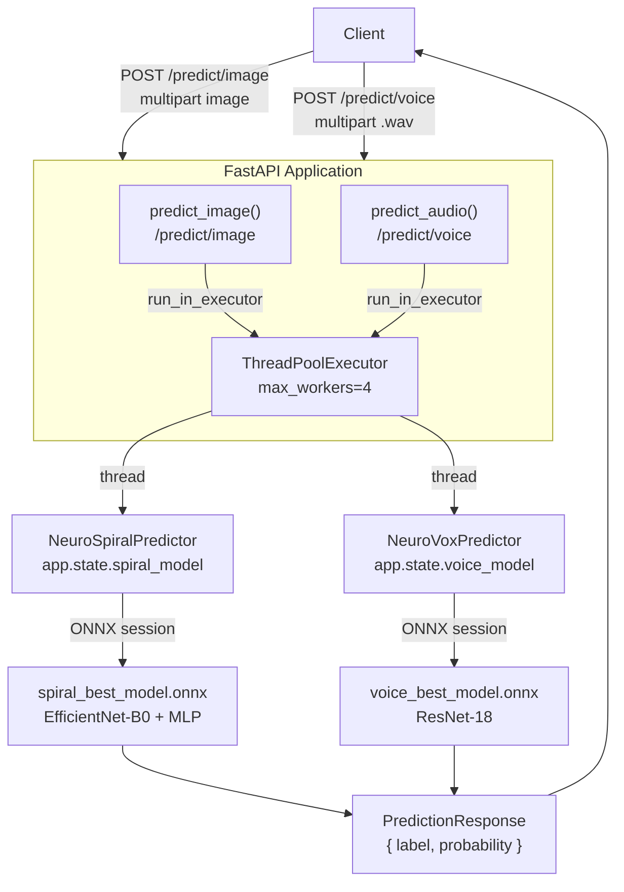

# System Architecture

## Design Philosophy

NeuroVive is designed around three core principles:

1. **Non-blocking I/O** — The FastAPI event loop handles HTTP connections; all CPU-bound ML inference runs in a thread pool.
2. **Single load, many requests** — Both ONNX models are loaded once at startup and stored on `app.state`, shared across all requests without reloading.
3. **Clean separation** — Each modality (image, voice) has its own predictor class and endpoint; they share only the response schema and the executor.

---

## Full System Diagram



---

## Application Lifecycle (`lifespan`)

The `lifespan` async context manager in `src/utils/helper.py` manages startup and shutdown:

```
┌─ STARTUP ────────────────────────────────────────────────────────────────┐
│  1. os.makedirs("tmp/", exist_ok=True)                                   │
│     → ensures temp directory exists for audio uploads                    │
│                                                                          │
│  2. app.state.executor = ThreadPoolExecutor(max_workers=4)               │
│     → shared thread pool for both predictors                             │
│                                                                          │
│  3. app.state.voice_model  = NeuroVoxPredictor(voice_model_path)         │
│     → loads voice_best_model.onnx into ONNX Runtime session              │
│                                                                          │
│  4. reducers = joblib.load(REDUCERS_PATH)                                │
│     app.state.spiral_model = NeuroSpiralPredictor(                       │
│       spiral_model_path, vt, scaler, pca                                 │
│     )                                                                    │
│     → loads ONNX + fitted feature reducers (VT / Scaler / PCA)          │
└──────────────────────────────────────────────────────────────────────────┘

   [ Application running — handles requests ]

┌─ SHUTDOWN ───────────────────────────────────────────────────────────────┐
│  app.state.executor.shutdown(wait=True)                                  │
│  → gracefully waits for any in-flight inference to complete              │
│  → then releases thread pool resources                                   │
└──────────────────────────────────────────────────────────────────────────┘
```

---

## Request Lifecycle — Image Endpoint

```
Client sends POST /predict/image
           │
    ┌──────▼───────┐
    │ Validate     │  content_type.startswith("image/")
    │ MIME type    │  → 415 if invalid
    └──────┬───────┘
           │
    ┌──────▼───────┐
    │ Decode image │  np.frombuffer → cv2.imdecode
    │              │  → 400 if result is None
    └──────┬───────┘
           │
    ┌──────▼────────────────────┐
    │ await _run_in_executor()  │  offload to ThreadPoolExecutor
    │ spiral_model.predict(img) │  → 500 on exception
    └──────┬────────────────────┘
           │
    ┌──────▼───────────────────┐
    │ Return PredResponse      │  { label, probability }
    └──────────────────────────┘
```

## Request Lifecycle — Voice Endpoint

```
Client sends POST /predict/voice
           │
    ┌──────▼───────┐
    │ Validate     │  filename.endswith(".wav")
    │ extension    │  → 415 if invalid
    └──────┬───────┘
           │
    ┌──────▼───────────────────┐
    │ Stream to tmp/<uuid>.wav │  1 MB chunks — avoids full memory load
    └──────┬───────────────────┘
           │
    ┌──────▼────────────────────┐
    │ await _run_in_executor()  │  offload to ThreadPoolExecutor
    │ voice_model.predict(path) │  → cleanup + 500 on error
    └──────┬────────────────────┘
           │
    ┌──────▼──────────────────────────┐
    │ BackgroundTask: remove_file()   │  async delete after response sent
    └──────┬──────────────────────────┘
           │
    ┌──────▼───────────────────┐
    │ Return PredResponse      │  { label, probability }
    └──────────────────────────┘
```

---

## Concurrency Model

```
HTTP Request 1 (image) ──┐
HTTP Request 2 (voice) ──┤──► FastAPI Event Loop (async, single thread)
HTTP Request 3 (image) ──┘         │
                                   │  await run_in_executor(...)
                         ┌─────────┴─────────────────────────┐
                         │       ThreadPoolExecutor          │
                         │  Thread 1 │ Thread 2 │ Thread 3   │
                         │  spiral   │  voice   │  spiral    │
                         │  predict  │  predict │  predict   │
                         └───────────────────────────────────┘
```

- The event loop is **never blocked** — it handles new HTTP connections while inference runs in background threads.
- Up to **4 concurrent** inference calls are processed in parallel (`max_workers=4`).
- Requests beyond the pool capacity are **queued** automatically by the executor.
- Both model sessions are **thread-safe** for concurrent read inference in ONNX Runtime.

---

## Configuration Reference

All paths and model parameters live in `src/constant/constant.py`:

```python
# Paths
base_dir          = Path(__file__).resolve().parent.parent.parent
voice_model_path  = base_dir / "checkpoint" / "voice_best_model.onnx"
spiral_model_path = base_dir / "checkpoint" / "spiral_best_model.onnx"
REDUCERS_PATH     = base_dir / "checkpoint" / "feature_reducers.pkl"
TMP_DIR           = "tmp"

# Audio (shared with NeuroVox training)
sample_rate  = 22050
duration     = 6          # seconds
n_fft        = 1024
n_mel        = 40
hop_length   = n_fft // 4  # 256

# Image (shared with NeuroSpiral training)
IMAGE_SIZE          = (224, 224)
HOG_ORIENTATIONS    = 9
HOG_PIXELS_PER_CELL = (16, 16)
HOG_CELLS_PER_BLOCK = (2, 2)
LBP_RADIUS          = 1
LBP_N_POINTS        = 8 * LBP_RADIUS
LBP_HIST_BINS       = 10
LBP_HIST_RANGE      = (0, 10)

# ONNX
providers = ["CUDAExecutionProvider", "CPUExecutionProvider"]
```

---

## Shared Utilities (`src/utils/helper.py`)

| Symbol              | Type                  | Description                                           |
| ------------------- | --------------------- | ----------------------------------------------------- |
| `lifespan`          | async context manager | App startup/shutdown — loads models, creates executor |
| `remove_file(path)` | function              | Safe file deletion with exception handling            |
| `TMP_DIR`           | constant              | Directory for temporary audio uploads (`"tmp"`)       |

These are imported into `src/api/endpoint.py` to keep the route file focused purely on HTTP logic.
